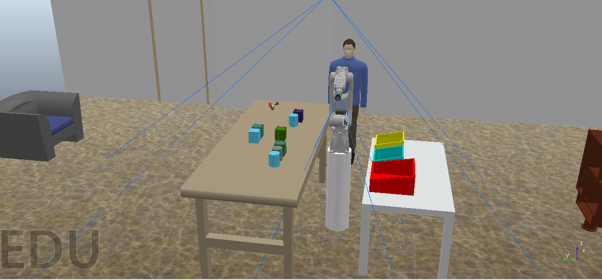
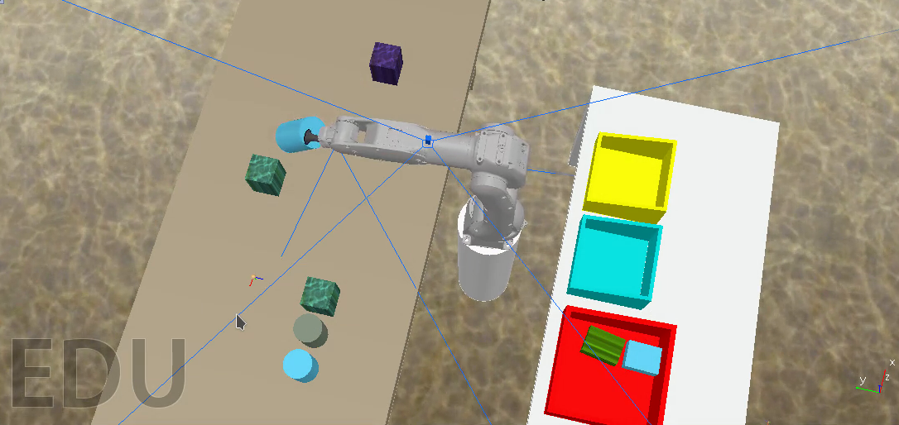
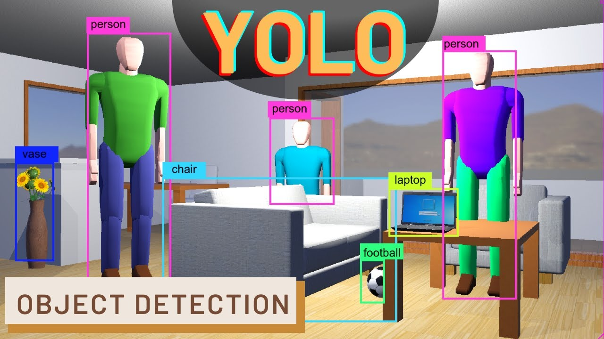

## My Robotic Arm
<!--<h4>Object picking and Placing with a 3-DOF <br> Articulated Robotic Manipulator<br>using ROS</h4>-->

<p align="center">
<b><i>Object picking and Placing with 3 DOF Articulated Manipulator using ROS and Simulated in CoppeliaSim (Open Dynamics Engine)</i></b>
</p>

<p align="center">

</p>

<p align="center">
<b>Muhammad Muneeb ur Rehman</b>
<br>
<a href="mailto:muneeburrehman197@gmail.com" target="_top">muneeburrehman197@gmail.com</a>
</p>

------------

## Abbreviations

- **ARC:** Amazon Robotics Challenge
- **ROS:** Robot Operating System
- **DOF:** Degrees of Freedom
- **EE:** End Effector

### Working of Autonomous Robotic Arm Pick and Place Work Flow in Simulation

<p align="center">

</p>


# 1. Introduction

This project is inspired by [Amazon Robotics Challenge](https://www.amazonrobotics.com/#/roboticschallenge), where decision making, for autonomous picking and stowing, picking objects  off shelves and putting them in shipping boxes, still remains a challenging task.

As per ARC rules, robotic arm must be capable of these:

- Object Recognition
- Pose (position + Orientation) Recognition
- Pick Planning
- Compliant Manipulation
- Motion Planning
- Error Detection and Recovery

In this project, all above mentioned conditions are satisfied, except, there are some limitations. 

As it is 3 DOF robotic arm, only three spatial position coordinates are possible (we cannot control the orientation of manipulator EE). Also error detection is a part of project, but error recovery is not yet implemented, although it is a part of future work.

### Objective

Commercially viable autonomous picking and placing in unstructured (dynamic) environment still remains a difficult challenge. The objective of this project is to demonstrate the autonomous capability of 3 DOF articulated manipulator in simulation to pick an object and placing it in appropriate box.

Within the context of this project, a single pick and place cycle can be divided into following tasks:

1. Identify the target object on table using 2D Vision sensor (RGB Camera)
2. Classify and Localize the Object using YOLOv3 (supervised machine learning object detection algorithm)
3. Perform Inverse Kinematics (to calculate joint angles)
4. Plan the clean movement toward the object to pick
5. Efficiently pick the object using suction gripper
6. Plan and perform a clean movement towards a drop site
7. Drop an object in appropriate box

### Relevance

The object detection using computer vision methods, such as edge detection, color gradient etc. is usually used for many applications. This method is suitable for just structured environments where conditions remain same with time. For dynamic and unstructured environments, traditional computer vision becomes irrelevant to implement.

Machine learning classification model is widely used for object detection. Machine learning enables machines to behave intelligently in dynamics scenarios and take decisions. Object detection performs two task: Object Classification and Object Localization.

Object Classification refers to detecting the object in workspace and classifying into predefined class. For example, in the below image, person, vase, chair, laptop, football etc. are predefined classes of objects that our machine learning algorithm learns to predict after training a model.



We have trained our machine learning model for detecting various shapes, predominantly, square, circle, and triangle etc. Machine learning model can be trained to predict any set of objects as per the need of application, this proves the robustness of system.

### Applications

Robotic manipulators have become ubiquitous in almost every industry; from food, beverage, shipping and packaging to manufacturing. Almost all robotic applications face the fundamental challenge of decision making, how to perform a certain task? If we can incorporate the artificial intelligence and machine learning into our robotic systems in such a way to completely automate the task, it will be massive industrial disruption.

This project is mainly focused on applications of robotics in retail stores and in distribution centers.

# 2. Environment Setup

This project uses YOLOv3 Object detection algorithm, so to work with this one, you need following things:

1. ROS (Robot Operating System) Noetic
2. CoppeliaSim (Previously V-REP)

The Project has been tested on Ubuntu 20.04, using ROS Noetic and CoppeliaSim.

### Prerequisites

- Darknet ROS Installed (YOLOv3 Package for ROS)
- Trained Model (Weights File)
- ROS Noetic
- CoppeliaSim

You can download pretrained model (based on publicly available dataset), use our dataset (for shape detection), or train model using your own dataset.

To train a model using your own custom dataset, refer to the following blog post for complete guide. [How to train custom YOLOv3 Object detection Model using Google Colab](https://headstartguide.com/how-to-train-custom-yolov3-model-using-google-colab)

Download pretrained model for shapes detection from here, or pretrained model of publicly available dataset from here.

**Note:** For this project to work without any modification, you will need to download pretrained model for shape detection. For any other trained model, you will have to change the codebase and setup.

### ROS Setup

Go to "src" directory or your workspace, and clone "darknet_ros" repository there.

```bash
cd catkin_ws/src
```

```bash
git clone --recursive -b updated https://github.com/munn33b/darknet_ros.git
```

Next, build the workspace
```bash
cd ..
```

```bash
catkin_make
```

**Note:** This may take long time to compile everything, so please be patient, and wait for it to complete.

After that's done, clone "gp7_visualization" package in the "src" of your workspace.

```bash
git clone https://github.com/munn33b/gp7_visualization.git
```

**Note:** GP7 is the industrial robotic arm, manufactured by Yaskawa. We have used this robotic arm for simulations. The package, "gp7_visualization", contains all description files (meshes, mass properties, joints etc) for the robotic arm.

Next up, we need to clone the main repository containing all controllers, motion planners, object detection pipelines etc. This is main repository and contains two packages. Clone it into "src" directory of your workspace.

```bash
git clone https://github.com/munn33b/my-robotic-arm.git	
```

Now, build the three packages you have just cloned into your workspace.

```bash
catkin_make --only-pkg-with-deps my_robotic_arm gp7_visualization gp7_robot_moveit_config
```

Once everything is finished, source the workspace again:

`source devel/setup.bash`

### CoppeliaSim Setup

For the simulation of project, you will need to download CoppeliaSim. Go to [Download Link](https://www.coppeliarobotics.com/files/CoppeliaSim_Edu_V4_3_0_rev12_Ubuntu20_04.tar.xz)

After downloading the package, extract it into any directory. Next, go to that directory and run following command, in your terminal, to run it

```bash
./coppeliaSim.sh
```


This is the default user interface of CoppeliaSim (Although color scheme is different).

We need the plugin to interface ROS with CoppeliaSim before we can run our simulation.

Go th "src" of your main ROS workspace, for example,

```bash
cd catkin_ws/src
```

and clone the following package "simExtROS", using command,

```bash
git clone https://github.com/CoppeliaRobotics/simROS.git sim_ros_interface
```

Next, we need to make some modifications into the "messages.txt" file inside "meta" directory. Go to directory "simExtROS/meta/" and open file "messages.txt", using your favorite text editor. For me it's nano!

```bash
nano simExtROS/meta/messages.txt
```

and add the following on first line of file,

`rospy_tutorials/Floats`

Then, run the following commands
```bash
cd sim_ros_interface
```

```bash
git checkout coppeliasim-v4.3.0-rev12
```
You may also require the following package installed in Linux "xsltproc', for successful compilation. To install the package, run following command
```bash
sudo apt install xsltproc
```

Next, compile the package, using,

```bash
catkin_make --only-pkg-with-deps sim_ros_interface
```

Now, everything done, as far as the environment setup is concerned. We can now run the simulation!

